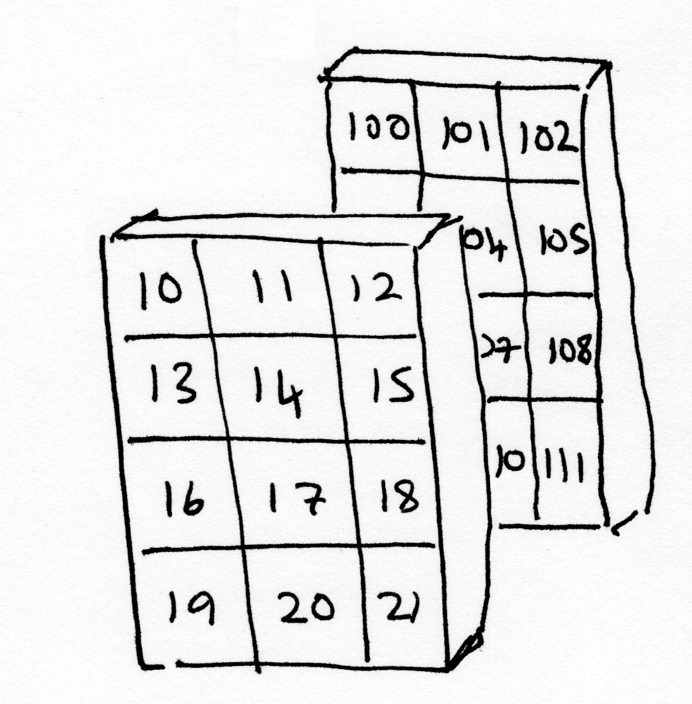
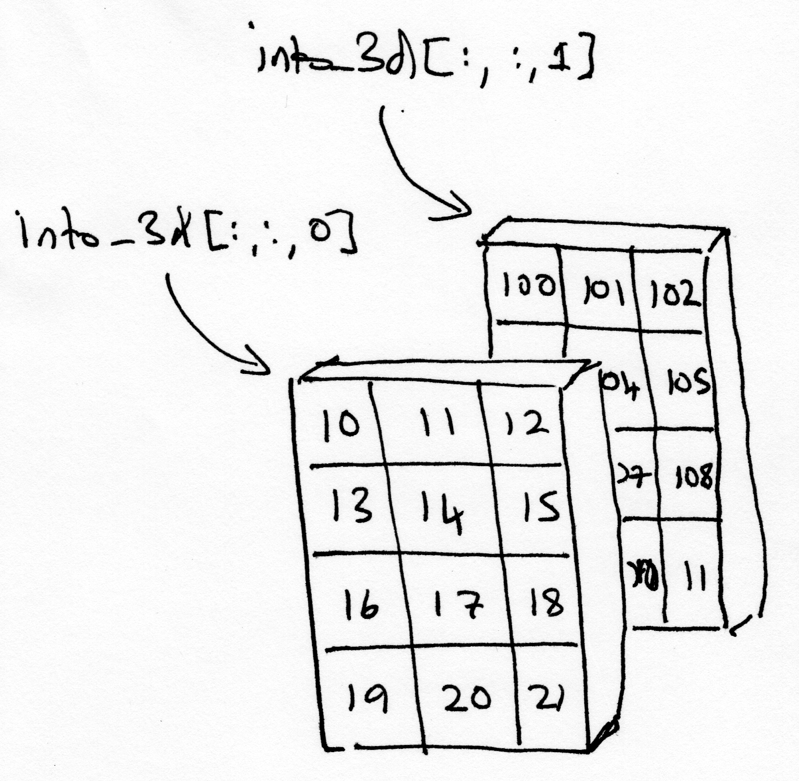
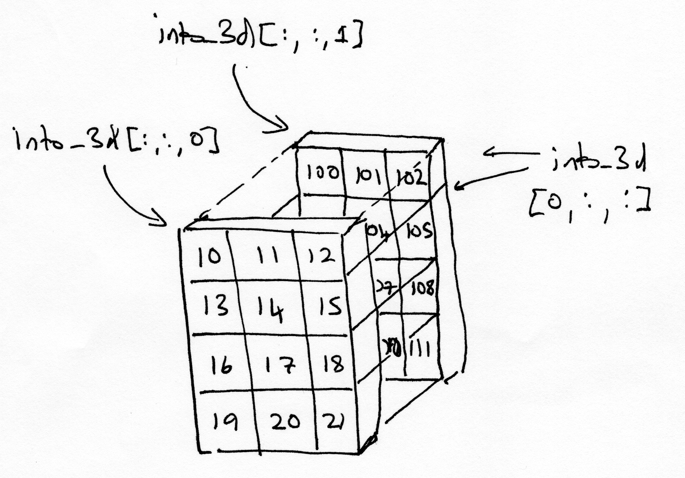
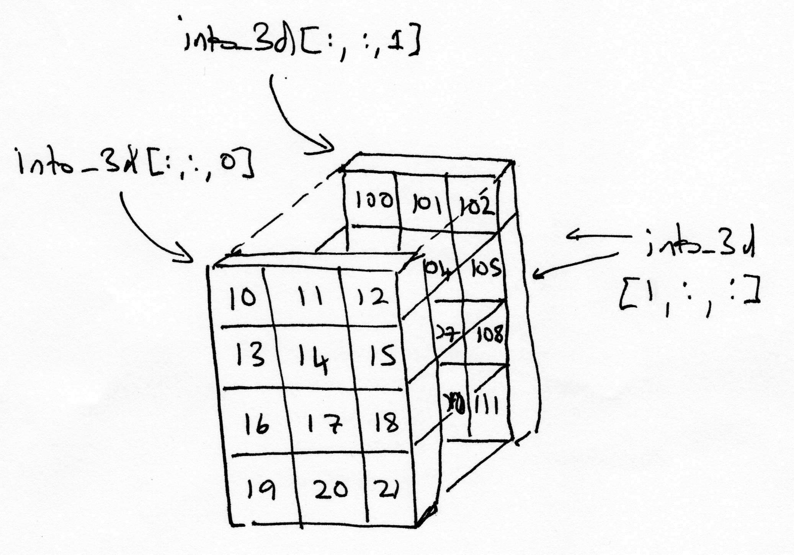

---
jupyter:
  jupytext:
    notebook_metadata_filter: all,-language_info
    split_at_heading: true
    text_representation:
      extension: .Rmd
      format_name: rmarkdown
      format_version: '1.2'
      jupytext_version: 1.10.1
  kernelspec:
    display_name: Python 3 (ipykernel)
    language: python
    name: python3
---

# Three-dimensional arrays

```{python}
# Our usual set-up
import numpy as np
import matplotlib.pyplot as plt

# Set 'gray' as the default colormap
plt.rcParams['image.cmap'] = 'gray'

# Display array values to 4 digits of precision
np.set_printoptions(precision=4, suppress=True)
```

So far we have seen one-dimensional and two-dimensional arrays.  These are easy to think about, the one-dimensional array is like a row from a table or spreadsheet.  A two-dimensional array has rows and columns, like a table or a spreadsheet.

A three-dimensional array takes a little bit more work to visualize, and get used to.

## Two dimensions before three

One way to think of three-dimensional arrays is as stacks of 2D arrays.

Here are a couple of two-dimensional arrays.

```{python}
# make the first 2D array
first_1d = np.arange(10, 22)
first_2d = np.reshape(first_1d, (4, 3))

# show the first 2D array
first_2d
```

```{python}
# make the second 2D array
second_1d = np.arange(100, 112)
second_2d = np.reshape(second_1d, (4, 3))

# show the second 2D array
second_2d
```

We can get rows from the 2D arrays by slicing with an index on the first dimension, thus:

```{python}
# Third row, all the columns.
first_2d[2, :]
```

Or, we can get columns by slicing with an index on the second dimension:

```{python}
# All the rows, second column.
first_2d[:, 1]
```

These 2D arrays have four elements along the first dimension (axis), and three
elements along the second dimension (axis).

```{python}
first_2d.shape
```

They therefore have `4 * 3 = 12` elements each.   The `np.prod` function multiples all the elements in a sequence, so we can get the number of elements in an array with:

```{python}
# 4 * 3
np.prod(first_2d.shape)
```

but there is even a short-cut way to get that:

```{python}
first_2d.size
```

## Three dimensions

Here we make a three-dimensional array, by stacking the two 2D arrays together.

Let's look again at the `first_2d` array: 

```{python}
first_2d
```

and the `second_2d` array:

```{python}
second_2d
```

If you imagine the `first_2d` array and the `second_2d` array as physical objects, then when we stack them, we will get the 3D array shown in the image below:





The object in the foreground of the image (with 10, 11, 12 on its topmost row) is the first *slab* of the 3D array, and contains the values from the `first_2d` array. The object in the background of the image (with 100, 101, 102 on its topmost row) is the second slab, and contains the values from the `second_2d` array.

To create the 3D array, first we create an empty array of the right shape:

```{python}
# make a 3D array
into_3d = np.zeros((4, 3, 2))

# show the 3D array
into_3d
```

The 3D array, as numpy shows it, might not have an obvious resemblance to the image of the two slabs shown above, but bear with us.

The 3D array is of the right shape:

```{python}
into_3d.shape
```

The shape can be read as 'two slabs, each with 4 rows and 3 columns', which corresponds to what is shown in the image of the slabs above.

Currently the 3D array only contains 0s, so next we make the `first_2d` array be the first 4 by 3 slab of the 3D array:

```{python}
# show the first_2d array
first_2d
```

```{python}
# Set all rows, all columns for slab 0 to be the first_2d array
into_3d[:, :, 0] = first_2d
```

The image below shows how the `into_3d` array now looks, with the `first_2d` array as the first 3 by 4 slab:


Next we make the `second_2d` array be the second 4 by 3 slab of the 3D array:

```{python}
# show the second_2d array
second_2d
```

```{python}
# Set all rows, all columns for slab 1 to be the second_2d array
into_3d[:, :, 1] = second_2d
```
We have just stacked the `first_2d` and `second_2d` arrays into the `into_3d` array. The image below shows how the index commands we just used in order to do this relate to the slabs of the `into_3d` array, and to the values that are now in each slab.

`into_3d[:, :, 0]` can be read as *'all rows, all columns of slab 0'*.

`into_3d[:, :, 1]` can be read as *'all rows, all columns of slab 1'*.





The output of the cell below is how Numpy shows us the contents of the `into_3d` array:

```{python}
into_3d
```

Relative to the images above, this is a different way of looking at the `into_3d` array, where the slices are in the first dimension, like this:

```{python}
# First row, all columns, all slabs.
into_3d[0, :, :]
```



```{python}
# Second row, all columns, all slabs.
into_3d[1, :, :]
```




Make a prediction of what the values would look like by slicing in the second dimension.
Check your guess below:

```{python}
# Your code here
```
