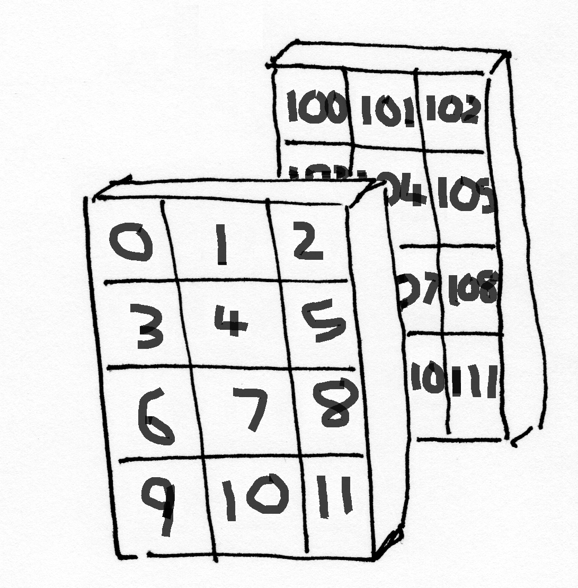
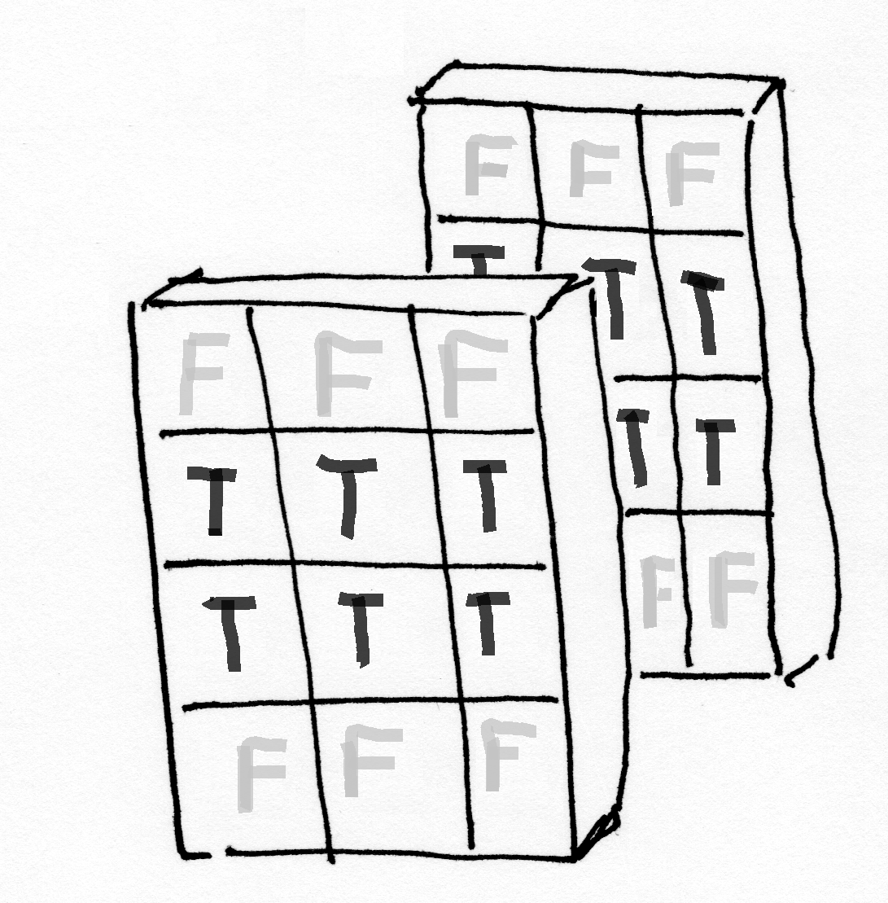
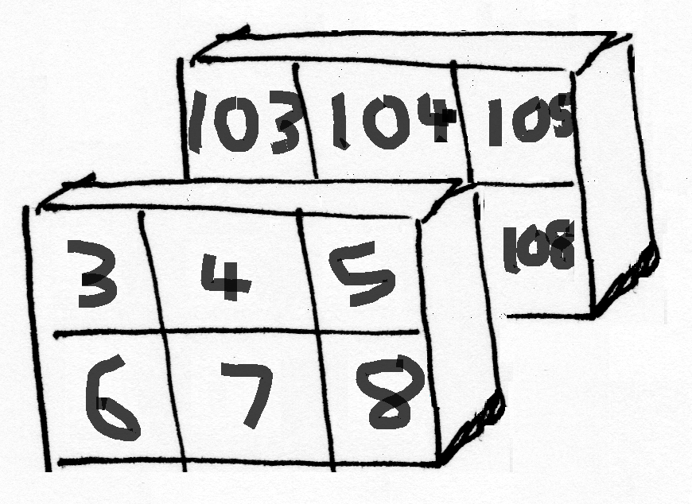
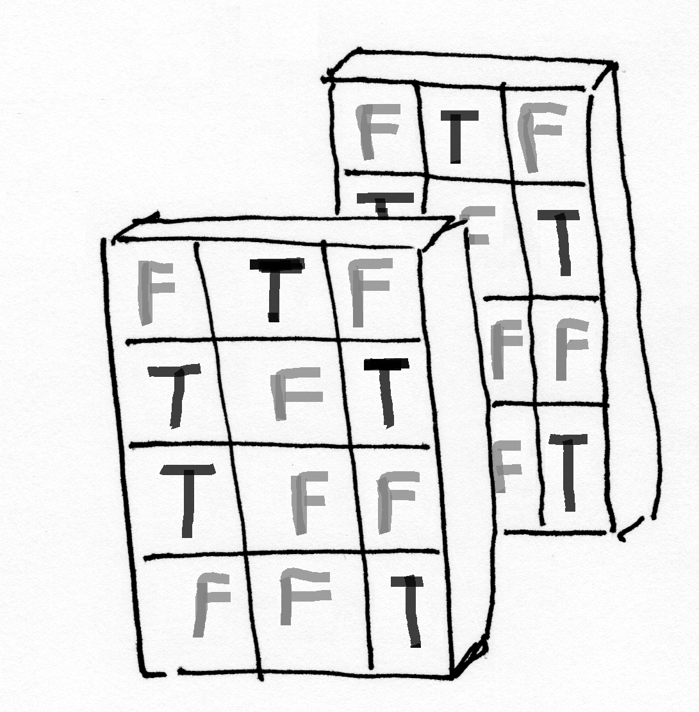
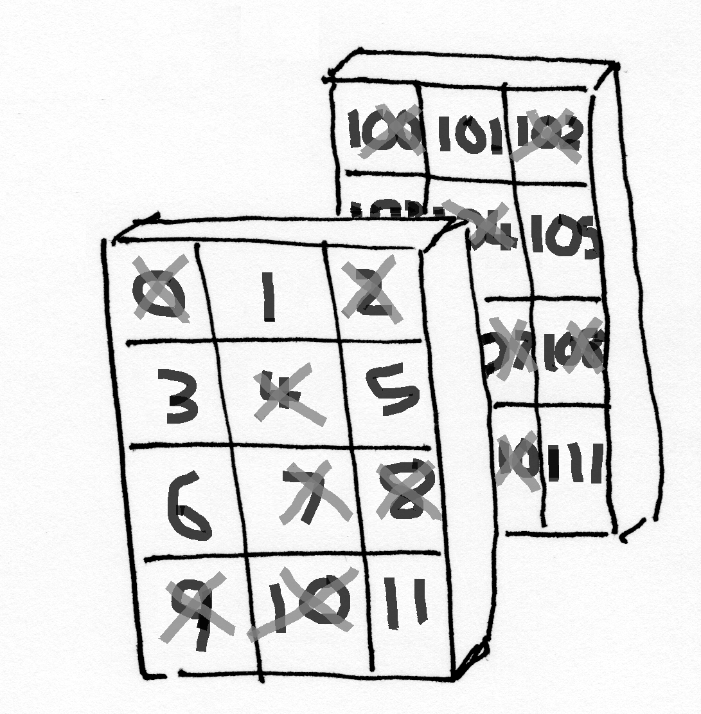
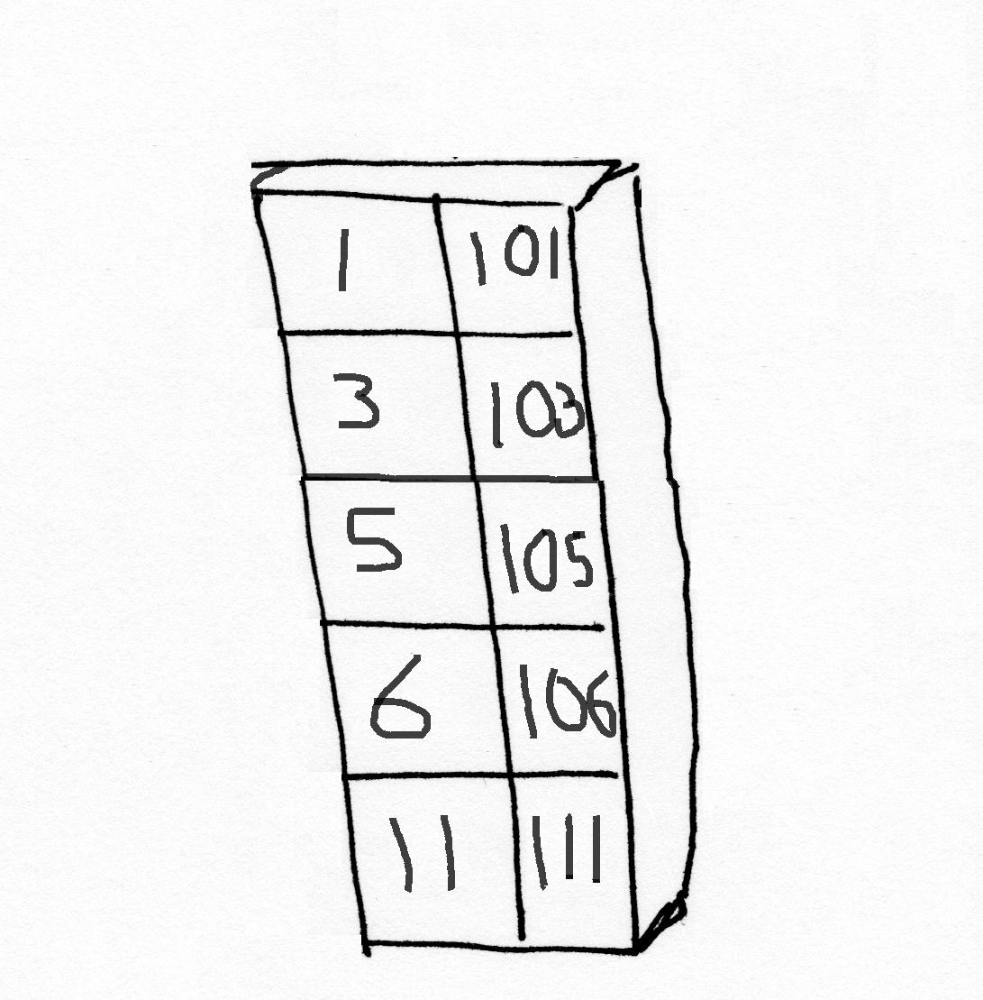

---
jupyter:
  jupytext:
    text_representation:
      extension: .Rmd
      format_name: rmarkdown
      format_version: '1.2'
      jupytext_version: 1.10.1
  kernelspec:
    display_name: Python 3 (ipykernel)
    language: python
    name: python3
  orphan: true
---

# Boolean indexing with more than one dimension


```{python}
# import common modules
import numpy as np  # the Python array package
import matplotlib.pyplot as plt  # the Python plotting package
```

First we make a 3D array of shape (4, 3, 2)

```{python}
# create an array of numbers from 0 to 11 inclusive, reshape this into a 4 rows by 3 columns array
plane0 = np.reshape(np.arange(12), (4, 3))
plane0
```

```{python}
# create an array of numbers from 100 to 111 inclusive, reshape this into a 4 rows by 3 columns array
plane1 = np.reshape(np.arange(100, 112), (4, 3))
plane1
```

```{python}
# create a 3D array, full of 0s, with 4 rows, 3 columns and 2 planes, all filled with 0s
arr_3d = np.zeros((4, 3, 2))

# set the first plane to be equal to plane0
arr_3d[:, :, 0] = plane0

# set the first plane to be equal to plane1
arr_3d[:, :, 1] = plane1

# show the array
arr_3d
```

Pictured in 3D space, this array looks as below:




We can index this with a one-dimensional Boolean array. This selects
elements from the first axis.

```{python}
bool_1d = np.array([False, True, True, False])
arr_3d[bool_1d]
```

<!-- #region -->
Pictured in 3D space, the first axis is the rows, across each plane. So, using `[False, True, True, False]` to index `arr_3d` is equivalent to stating "give me the the 2nd and 3rd rows, across both planes, from `arr_3d`".

Visualised in 3D space, this looks as follows:




Remember that the `True` and `False` values in the boolean array act as 'switches': only the elements corresponding to `True` make it into the final array:


<!-- #endregion -->

```{python}
# show the final array, from indexing arr_3d with bool_1d
arr_3d[bool_1d]
```

We can also index with a two-dimensional Boolean array, this selects elements
from the first two axes.

```{python}
bool_2d = np.array([[False, True, False],
                    [True, False, True],
                    [True, False, False],
                    [False, False, True],
                   ])
bool_2d
```

```{python}
# index arr_3d with bool_2d
arr_3d[bool_2d]
```

You can think of the `bool_2d` array as 'switching' on or off individual columns of the `arr_3d` array. If we show this as a sequence, pictured in 3D space, it looks as follows:







In this case, using `bool_2d` to index `arr_3d` yields an array with one plane, with 5 rows and 2 columns:

```{python}
arr_3d[bool_2d]
```

```{python}
# show the shape of the arr_3d array, when indexed with the bool_2d boolean array
arr_3d[bool_2d].shape
```

Pictured in 3D space, the final array, from indexing `arr_3d` with `bool_2d`, looks as below:




We can even index with a 3D array, this selects elements over all three
dimensions.  In which order does it get the elements?

```{python}
# a boolean array, True where arr_3d is odd, False otherwise
arr_is_odd = (arr_3d % 2) == 1
arr_is_odd
```

```{python}
# use arr_is_odd to index arr_3d
arr_3d[arr_is_odd]
```

<!-- #region -->
For reference, here is the 3D visualisation of `arr_3d`:


<!-- #endregion -->

We can mix 1D Boolean arrays with ordinary slicing to select elements on
a single axis. E.g. the code below returns the entire second plane of `arr_3d`:

```{python}
bool_1d_dim3 = np.array([False, True])
arr_3d[:, :, bool_1d_dim3]
```
