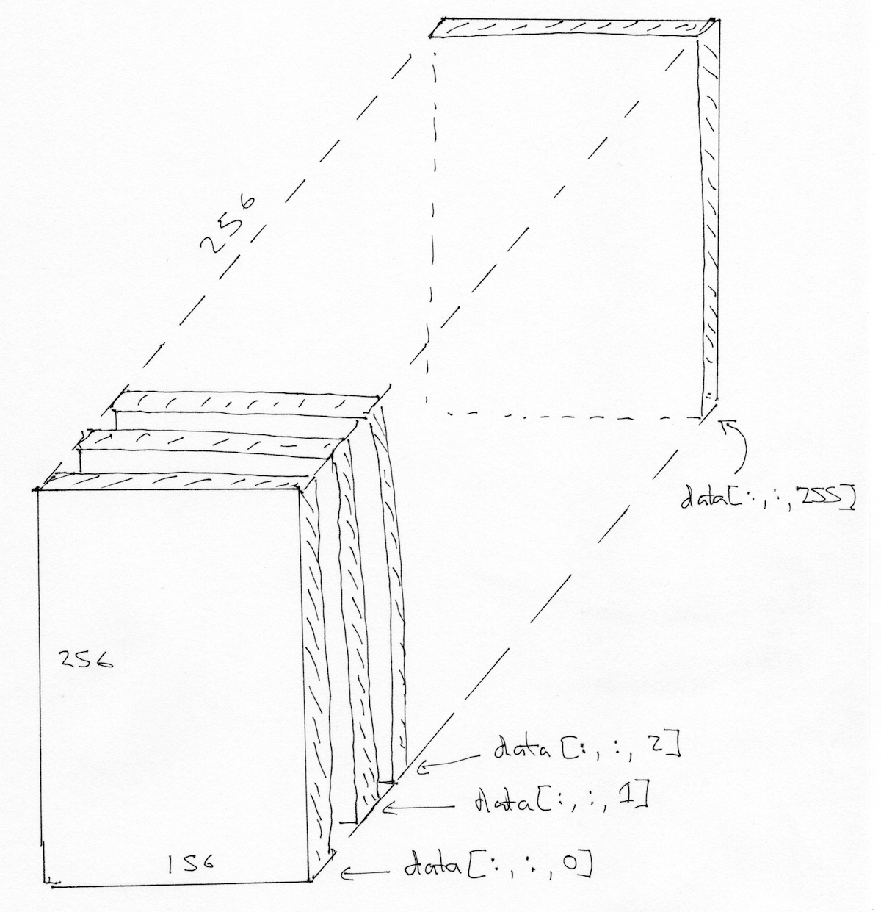
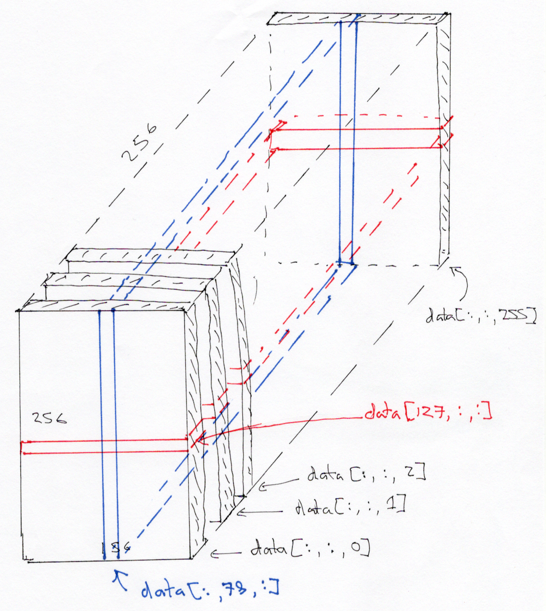

---
jupyter:
  jupytext:
    text_representation:
      extension: .Rmd
      format_name: rmarkdown
      format_version: '1.0'
      jupytext_version: 0.8.1
  kernelspec:
    display_name: Python 3
    language: python
    name: python3
  language_info:
    codemirror_mode:
      name: ipython
      version: 3
    file_extension: .py
    mimetype: text/x-python
    name: python
    nbconvert_exporter: python
    pygments_lexer: ipython3
    version: 3.6.5
---

# Three-dimensional images, NIfTI

```{python}
# Our usual set-up
import numpy as np
import matplotlib.pyplot as plt

# Set 'gray' as the default colormap
plt.rcParams['image.cmap'] = 'gray'

# Display array values to 4 digits of precision
np.set_printoptions(precision=4, suppress=True)
```

We will spend a lot of time loading data from brain images.

MRI images for functional MRI analysis are usually stored using the [NIfTI
format](https://nifti.nimh.nih.gov/nifti-1).

As you've already seen, this is a very simple format that is typically a
single file with extension `.nii`.  If the file is compressed, it will end
with `.nii.gz` instead.

Inside, the file contains:

* 352 bytes of *header* information.  Among other things, the header
  gives the 3D or 4D shape of the file, and the data type of the pixel
  (voxel) data.
* Usually, directly after the header, we have the image data.  If the image
  data is shape (I, J, K), and S is the number of bytes to store the data for
  one pixel (voxel) value, then the image data is `I * J * K * S` in length.
  For example, the image might be shape 64, 64, 32, and the data type might be
  64-bit float, which is 8 bytes long, so the image data would be
  `64 * 64 * 32 * 8` bytes long.

To load these images into Python, use the [Nibabel](http://nipy.org/nibabel)
package.

Start by importing the Nibabel library:

```{python}
import nibabel as nib
```

We will use the Nipraxis package to fetch the image data file:

```{python}
import nipraxis

structural_fname = nipraxis.fetch_file('ds114_sub009_highres.nii')
structural_fname
```

Load the image into memory:

```{python}
img = nib.load(structural_fname)
img
```

The image has a "header" containing the information about the image:

```{python}
print(img.header)
```

If you happen to have the [FSL
package](https://fsl.fmrib.ox.ac.uk/fsl/fslwiki/) installed, you can get the
same information from FSL's `fslinfo`. If you do have FSL, run this command
from the terminal:

```
fslinfo ds114_sub009_highres.nii
```


We can load the image data as an array of floating point numbers with:

```{python}
data = img.get_fdata()
data.shape
```

Think of this as 256 2D images, stacked on top of one another.  Each 2D image
is a "slice", of shape (256, 156).

The first (bottom) slice:

```{python}
bottom_slice = data[:, :, 0]
plt.imshow(bottom_slice)
```

The middle slice:

```{python}
middle_slice = data[:, :, 127]
plt.imshow(middle_slice)
```

We might be interested to look at the histogram of voxel values in this 3D block.  In order to do that, we `np.ravel` the 3D volume to 1D, to throw away the spatial arrangement of the voxels.

```{python}
# Show histogram of the values in the 3D image.
plt.hist(np.ravel(data), bins=100);
```

Let us return to the middle slice. As for any array, we can transpose it, to flip the rows and the columns:

```{python}
plt.imshow(middle_slice.T)
```

To get the display you usually see in dedicated imaging display software, we
need to transpose *and* flip up to down:

```{python}
to_display = np.flipud(middle_slice.T)
plt.imshow(to_display)
```

We are looking at a slice *over the third dimension*.  We will sometimes refer
to this as a *plane*.  We can see that the planes are 2D images, where left to
right is the first axis, and back to front is the second axis.

As in [arrays and 3D](arrays_3d), we can think of the 3D image as a stack of
planes, where the bottom plane is the first, then the second is the second
from bottom, and so on:



We can also think of this 3D image as a stack of 2D images where the 2D images are (back to front, bottom to top), like this:

```{python}
yz_slice = data[127, :, :]
yz_slice.shape
```

```{python}
plt.imshow(yz_slice)
```

Here, we have all the pixels corresponding to 127 in the left to right
direction, giving us an image of shape (156, 256).


Here's a coronal slice:

```{python}
xz_slice = data[:, 78, :]
xz_slice.shape
```

```{python}
plt.imshow(xz_slice)
```


