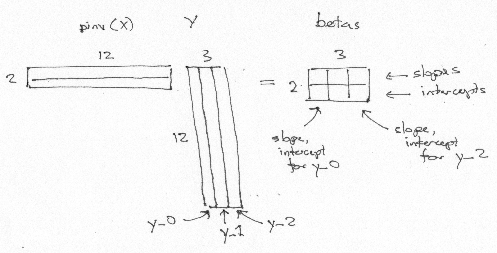

---
jupyter:
  jupytext:
    notebook_metadata_filter: all,-language_info
    split_at_heading: true
    text_representation:
      extension: .Rmd
      format_name: rmarkdown
      format_version: '1.2'
      jupytext_version: 1.13.7
  kernelspec:
    display_name: Python 3
    language: python
    name: python3
---

# Estimation for many voxels at the same time

We often want to fit the same design to many different voxels.

Let’s make a design with a linear trend and a constant term:

```{python}
import numpy as np
import matplotlib.pyplot as plt
# Print arrays to 2 decimal places
np.set_printoptions(precision=2)
```

```{python}
X = np.ones((12, 2))
X[:, 0] = np.linspace(-1, 1, 12)
plt.imshow(X, cmap='gray')
```

To fit this design to any data, we take the pseudo-inverse:

```{python}
import numpy.linalg as npl
piX = npl.pinv(X)
piX
```

Notice the shape of the pseudo-inverse:

```{python}
piX.shape
```

Now let’s make some data to fit to. We will draw some samples from the standard
normal distribution.

```{python}
# Random number generator.
rng = np.random.default_rng()
# 12 random numbers from normal distribution, mean 0, std 1.
y_0 = rng.normal(size=12)
y_0
```

```{python}
beta_0 = piX @ y_0
beta_0
```

We can fit this same design to another set of data, using our already-calculated pseudo-inverse.

```{python}
y_1 = rng.normal(size=12)
y_1
```

```{python}
beta_1 = piX @ y_1
beta_1
```

And another!:

```{python}
y_2 = rng.normal(size=12)
beta_2 = piX @ y_2
beta_2
```

Now the trick. Because of the way that matrix multiplication works, we can fit
to these three sets of data with the one single matrix multiply:

```{python}
# Stack the data vectors into columns in a 2D array.
Y = np.vstack((y_0, y_1, y_2)).T
Y
```

```{python}
betas = piX @ Y
betas
```

Notice some features of the `betas` array:

* There is one *row* per *column in the design X*.
* There is one *column* per *column in the data Y*.
* The first *row* of `betas` contains the parameters corresponding to the first
  *column* of the design.  The first row therefore contains the *slope*
  parameters.
* The second row contains the parameters corresponding to the second *column* of
  the design.  The second row therefore contains the *intercept* parameters.
* The first *column* of `betas` contains the slope, intercept for the first
  data vector `y_0`.



Of course this trick will work for any number of columns of Y.

This trick is important because it allows us to estimate the same design on
huge number of data vectors very efficiently.  In imaging, this is useful
because we can arrange our image data in a one row per volume, one column per
voxel array, and use technique here for very fast estimation.
