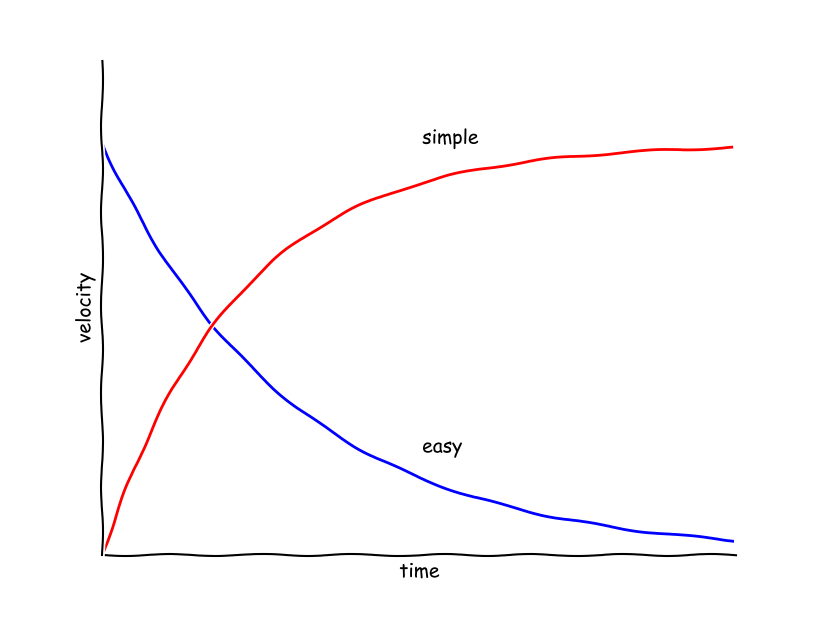

# The problem and the plan

## The plan

In this course, we teach two things:

1. functional MRI methods;
2. how to work with functional MRI data.

The first topic is obvious and familiar to those of you working in functional FMRI.  Of course you need to know how the methods work.  But what is this second thing — *how to work with* functional MRI data?   Isn't this the same thing?  Is it really something specific that we have to think about?  And if it is, isn't that an advanced topic, after we know the methods?

To answer that question, we need to talk about *the problem*.

## The problem

Functional MRI is really hard to learn and teach.  For those of us who have
tried to learn it, and teach it, this won't be controversial — this is our
experience.   But some of you are starting to learn, or starting to teach, and you may need to be convinced.

The difficulty is not surprising.  At a superficial level, the neuroimaging
researcher needs more than a passing knowledge of many fields, from many
disciplines.  Here is a back-of-the-envelope list:

* neuroanatomy;
* neurophysiology;
* data analysis;
* physics;
* signal processing;
* image processing;
* linear algebra;
* statistics.

You can do neuroimaging badly without knowing much about some of these, but to do it well, to ask intelligent fruitful questions, you will need a working knowledge of all of these, and deep knowledge in some of them.

That is a lot to ask, and a lot to teach.

Given there is so much to learn, how do we put ourselves in the best position to keep learning, and keep asking better questions?  If we are not careful, we can sink into disorganized practice, and the lack of organization will make it harder to see when we are thinking badly, or making mistakes.

That makes us ask — what is the typical practice of a neuroimaging researcher?

## Typical practice

Even in good institutions, we have seen that the great difficulties in learning and doing imaging make it common to fall into this patter.

* The practitioner **learns some of some of the areas** above, but at
  a superficial "makes-sense" level.  The "makes-sense" level is the level at
  which you are prepared to take the word of your teacher on facts and
  interpretation, but you can't challenge what your teacher is saying, because
  you don't understand it deeply enough.
* Then you **pick up the rest as you go**.  In practice there is a very strong
  temptation to accept practice on faith, consciously or unconsciously.  It's
  what your mentor does, or what the lab does.  You may not even ask yourself
  why your mentor or your lab does what it does.  They may not know
  themselves.  As the writer and doctor Anton Chekhov once said: "Medicine is
  the application of the laws of science; except there is a lot of law, and
  not much science."  Accepting practice on faith is particularly likely if
  you didn't get beyond the "makes-sense" level during your training.  And,
  the way we often do training, it's very difficult to get beyond that level.
* Most analysis practice is **encrusted habit**.  Neuroimaging analysis
  involves a great deal of computation, has many steps, and many possible
  analysis choices {cite}`carp2012plurality`.  It is very easy to get
  confused, it is very easy to make mistakes, and, unless you take a lot of
  care, it can be very difficult to replicate your own analysis, and all but
  impossible to replicate an analysis by someone else.  This confusion is
  a poison to clear thought.  [Professor Robin
  Murray](https://www.kcl.ac.uk/people/professor-sir-robin-murray) once
  suggested, in a talk on the rather trivial contribution of FMRI research to
  understanding schizophrenia, that the frontal lobes of FMRI researchers were
  so occupied by the difficulties of analysis, that they not longer had the
  capacity to think of a hypothesis.  The collective groan and laugh from the
  audience was good evidence of its painful truth.

## The tyranny of the typical

The problem then, is that disorganized analysis can make it impossible to
recover enough brain time to learn what you need to learn.  When the analysis
process is too disorganized, and too complicated to conceive of clearly, then
it becomes impossibly hard to ask the questions you need to ask.  These are
questions like "Do I believe this result?".  "What does this result mean at
a neural, physiological level?".  "How would I know if my hypothesis was
wrong?".  "What do I need to read and learn to understand this result
better?".

Disorganized analysis throws you into a hole, where you have many problems of thought as well as practice.

It leads to scientific work that is like science, but not science.  You'll see more on that below.

You will find that you make many mistakes, but you won't realize this, because your analysis process makes it very hard to check.

You will be inefficient; you will take a long time to do your analysis, and this time will not reduce markedly, with more experience.  You are not learning to automate and streamline your tasks, to make them easier to think about, and harder to get wrong.

It will be hard to collaborate, because it is hard to explain your process to yourself, and harder to explain to others, so they can engage with what you are doing.

# Like science, but not science

The problem then, is that the *process* of analysis can make it very difficult to do *science*.  That's a big claim, and one that begs the question, what is science?.

[Richard Feynman](https://en.wikipedia.org/wiki/Richard_Feynman) was a Nobel-laureate in theoretical physics, and a famous teacher and writer. He thought a lot about the nature of science.  In a famous talk, called "What is Science"  {cite}`feynman1969science`, he wrote:

> Science alone of all the subjects contains within itself the lesson of the
> danger of belief in the infallibility of the greatest teachers in the
> preceding generation... Learn from science that you must doubt the experts
> ...
> Science is the belief in the ignorance of experts

The Royal Society of London was founded on the same idea.  The motto of the Royal Society is "Nullius in Verba", often translated as "Take no-one's word for it".


(Image by kladcat under [CC BY
2.0](http://creativecommons.org/licenses/by/2.0), via Wikimedia Commons).

For Feynman, and the Royal Society, you cannot do science without having the
ability to question your assumptions and your teachers.  In imaging that can
be very difficult, because of the confusion from the process of analysis, and
because of the huge range of subjects you need to understand.

# Ubiquity of error

We would not have to worry, if, despite our disorganized process, we rarely
made mistakes.  But, in fact, error is invariable, pervasive in the
computational sciences.  David Donoho is a famous researcher in computation
statistics based at Stanford.  He has enormous knowledge and experience, and
this makes him worry *primarily* about error in his own work, and the work of
others.

> The scientific method's central motivation is the ubiquity of error - the
> awareness that mistakes and self-delusion can creep in absolutely anywhere
> and that the scientist's effort is primarily expended in recognizing and
> rooting out error." {cite}`donoho2009reproducible`.

This led Donoho and others to conclude that it was not reasonable to trust
a paper on computation, unless the authors had given the readers the ability to *reproduce* the exact analysis the authors had done.  The Stanford group put this strongly in an early article:

> An article about computational science in a scientific publication is not
> the scholarship itself, it is merely advertising of the scholarship.  The
> actual scholarship is the complete software development environment and the
> complete set of instructions which generated the figures"
> {cite}`buckheit1995wavelab`, also quoted in the [Wavelab front
> page](http://statweb.stanford.edu/~wavelab)

But — this is not an easy path to take.  If you want to make your work
reproducible, it has to be organized *as you do the work*.  As we said in
a paper on an earlier version of a course like this {cite}`millman2018rcsds`,
rigor is hard to retrofit.  You can try to do your analysis without much thought for organized process, but you will find it takes an enormous amount of work to go back and make your process reproducible.  And you won't gain from that work, because you'll have to do it all again for your next paper.  But if you learn to work in an organized thoughtful way *from the start*, it will take time, but that time will start to repay you over and over, in your future work.

## Understanding by building

We have talked about organized working, and you will soon find that organized
working for neuroimaging, as for many other data-intensive sciences, will need
to use code.

But there is something that happens when you start to use code.  Code is written in a *language* such as Python, and this language expresses *ideas* and *procedures*.  You will quickly find that this language is very powerful as a way to think about the ideas behind what you are doing.

The way that we use code here, is not only to help you work efficiently, but also to show you how to *build* the analysis, from the ground up.

Again, Richard Feynman put this idea in a very simple and powerful way.  When he died, this sentence was one of a few that he had left up on his Caltech blackboard:

> What I cannot create, I do not understand

We have found this to be a profound truth.   If you cannot imagine how you would build your own analysis, that's a good indication that you do not really understand your analysis.

We take that truth seriously here.  We will show you how to build
a simple-as-possible analysis of neuroimaging data *from the ground up*, using
basic building blocks from general scientific libraries.  Our idea is this: if
there is some terrible disaster, and, for some reason, all the current FMRI
analysis packages are lost, then you will not be lost.  It would be
inconvenient, and time-consuming, but you would say — "It's OK, I know what
the analysis needs to do, I'll build my own, and I'll get others to help me do
it".  Why?  Because you can create it, and you do understand it.

Building teaches understanding, but we also care about making our work clear, and efficient.  We want to get better and better at doing our analysis, and learning from the results.

# How to be efficient

The route to being efficient it to make your analysis *simple*.  But *simple* is *not* the same thing as *easy*.  As [Rich Hickey](https://en.wikipedia.org/wiki/Rich_Hickey) describes it in [talk about programming languages](http://www.infoq.com/presentations/Simple-Made-Easy):

* Simple comes from Latin *simplex* - one fold.  The opposite of *complex* -
  Latin for twisted together.
* Easy comes from old French *aiser* to Latin *adjacens* "lying close by".

Easy is what you are familiar with, not far from something you already know.
Simple is when you have succeeded in breaking the problem into separate ideas.

You can find a similar explanation in the Oxford dictionary of Word origins
edited by Julia Cresswell.

The point is that *simple* takes work.  You need to untangle the things that
are tangled.   Once you have done that, you can think about what you are doing
clearly.  You become more efficient.  On the other hand, if you stick with
easy, then everything stays tangled, and you cannot learn.  Your progress is
slowed by the knots in your ideas, and your work.  Simple leads to efficiency
and easy leads to stagnation.



## The plan returns

As you remember, we plan to teach you two things:

1. functional MRI methods;
2. how to work with functional MRI data.

We want to do that in way that will make your work *simple*.  We will do that
by using Feynman's idea of understanding by building. That will not be *easy*,
at first, but we hope you will find, rather quickly, that the basic ideas will be clearer — and you will have better tools to do your work.

To get there, we start with:

* Python;
* organized coding;
* version control.

We'll use that as a foundation for teaching imaging analysis.

We will emphasize:

* collaboration;
* transparency;
* reproducibility;
* learning from your peers.

We started to teach this course at Berkeley, and some of us still think of this as the "Berkeley Way", in a tribute to the famous [Toyota Way](https://en.wikipedia.org/wiki/The_Toyota_Way) of working.  We hope you find it useful, and we hope you go on to teach your friends and colleagues how to work this way.  We firmly believe that will lead to better, clearer, more interesting research, and then, to a better world.

## References

```{bibliography}
:filter: docname in docnames
```
