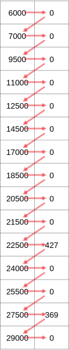

---
jupyter:
  jupytext:
    notebook_metadata_filter: all,-language_info
    split_at_heading: true
    text_representation:
      extension: .Rmd
      format_name: rmarkdown
      format_version: '1.2'
      jupytext_version: 1.10.3
  kernelspec:
    display_name: Python 3
    language: python
    name: python3
---

# Two-dimensions, reshaping

```{python}
import numpy as np

import pandas as pd

import nipraxis
```

Let us return to the problem of the [onsets and reaction
times](numpy_intro.Rmd).

Again, we get the interstimulus intervals and response times for each trial in
an experimental run:

```{python}
# Fetch the file.
stim_fname = nipraxis.fetch_file('24719.f3_beh_CHYM.csv')
data = pd.read_csv(stim_fname)
n_trials = len(data)
trial_isis = np.array(data['trial_ISI'])
response_times = np.array(data['response_time'])
```

Again we calculate the onset times of each trial relative to the start of the
scanning run.

```{python}
exp_onsets = np.cumsum(trial_isis)
scanner_onsets = exp_onsets + 4000
scanner_onsets[:15]
```

## 2D arrays

So far we have only used one-dimensional arrays.

For example, `scanner_onsets` is a one-dimensional array.  We can see this from
the array `shape`:

```{python}
scanner_onsets.shape
```

This tells us the array has one dimension, and that dimension has length 320.

Notice that the shape is a {ref}`tuple <tuples>`.  A tuple a type of sequence,
like a list.  See the link for details.  In this case, of a 1D array, the shape
is a [single element tuple](length_one_tuples.Rmd).

We can also have arrays with more than one dimension.  For example, we can make
a two-dimensional array of all zeros by passing the two-dimensional shape to
the `np.zeros` function, like this:

```{python}
# Make a two-dimensional array with 320 rows, 2 columns.
two_dimensions = np.zeros((320, 2))
# Notice the shape
two_dimensions.shape
```

This array has two dimensions, also called *axes*, so the shape is a
two-element tuple. 

We call the first dimension (axis) the *rows* and the second dimension the
*columns*.  The rows are the first axis (axis position 0).  The columns are the
second axis (axis position 1).

We can also make two-dimensional arrays by *stacking* arrays together.

For example, we can stack the `scanner_onsets` and the `response_times` into a
two-dimensional array, with two columns, like this:

```{python}
# Specify sequence of arrays to stack.
arrays_to_stack = [scanner_onsets, response_times]
# Stack the arrays into two columns (axis=1)
all_times = np.stack(arrays_to_stack, axis=1)
all_times.shape
```

To make things simpler to see in the examples below, we will use
two-dimensional indexing to restrict ourselves to the first 15 rows of the
array:


```{python}
first_15_rows = all_times[:15, :]
```

Notice the indexing above.  There are two parts of the indexing, separated by a
comma.  The first part is a *slice* for the rows (axis=0).  The second is an
*slice* for the columns (axis=1).

The row slice `:15` asks for the first 15 rows.  The column slice `:` asks for
all the columns.


## Reshaping


We often want to change the *shape* of arrays.

Our array above has 15 * 2 = 30 elements.  Numpy can change make any shape array from these 30 elements, as long as the shape corresponds to 30 elements.

For example, one common move is to take a 2D array and flatten it out into a 1D
array.  The corresponding 1D array would have one axis of length 30.

We could write the new shape as a [single element
tuple](length_one_tuples.Rmd), like this:

```{python}
new_shape = (30,)
```

We pass the new shape to the `np.reshape` function, along with the array:

```{python}
flattened = np.reshape(first_15_rows, new_shape)
flattened.shape
```

```{python}
# show the values.
flattened
```

Notice the way that Numpy filled out the 1D array from the 2D array.  It
fetches the elements by going across the columns first, and then the rows.
Call the original 2D thing `a`:

```{python}
a = first_15_rows
```

Then the first eight values of the 1D reshaped version comes from:

```{python}
[a[0,0], a[0,1],
 a[1,0], a[1,1],
 a[2,0], a[2,1],
 a[3,0], a[3,1]]
```

The image below shows the order in which `np.reshape` fetches the elements from the array:




We can reverse the process, by taking the flattened array, and putting it back
into its original two dimensions:

```{python}
unflattened = np.reshape(flattened, (15, 2))
unflattened.shape
```

```{python}
unflattened
```

Notice that the 1D to 2D reshaping above exactly reversed the original 2D to 1D
reshaping. Numpy fills the columns first, and then the rows.

Call the flattened (1D) version of the array `f`:

```{python}
f = flattened
```

So, the first four columns of the new array are given by:

```{python}
print('Row 0', [f[0], f[1]])
print('Row 1', [f[2], f[3]])
print('Row 2', [f[4], f[5]])
print('Row 3', [f[6], f[7]])
```

Here is another example of reshaping with an array of strings instead of numbers:

```{python}
# another 1D array, using single-character strings.
arr_1d_strs = np.array(['a', 'b', 'c', 'd', 'e', 'f', 'g', 'h'])
arr_1d_strs
```

```{python}
# Reshaping to a three by three 2D array.
# Notice that numpy fills across the columns of the new array, then rows.
new_shape = (2, 4)  # New shape, as a tuple.
arr_2d_strs = np.reshape(arr_1d_strs, new_shape)
arr_2d_strs
```

Back to 1D:

```{python}
np.reshape(arr_2d_strs, (8,))
```

As before, NumPy fetches the data across the columns, then the rows, to fill
out the elements of the 1D array.

## Reshape and -1

The value `-1` is special for `np.reshape`.  It means, "make a dimension the
size that will use the remaining unspecified elements".

For example, we could ask for the same 1D to 2D reshape above as:

```{python}
np.reshape(arr_1d_strs, (2, -1))
```

This works because, once we have specified 2 as the length of the first
dimension, Numpy can work out that the second dimension must be length 4, in
order to use all the elements.

From the same logic, we could also write:

```{python}
np.reshape(arr_1d_strs, (-1, 4))
```

Following the same logic, you can use -1 on its own as a shape, to reshape to
one dimension.

```{python}
np.reshape(arr_2d_strs, (-1,))
```

## Ravel

It is very common to reshape an array of any shape to a 1D array, so Numpy has
a short-cut function to do that:

```{python}
np.ravel(arr_2d_strs)
```
