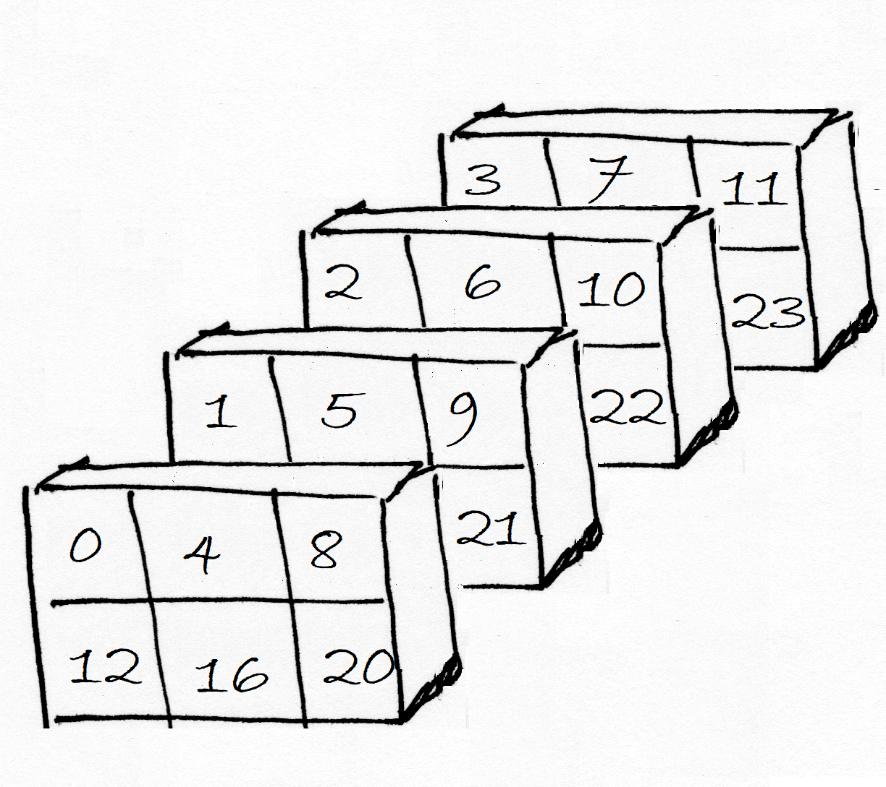
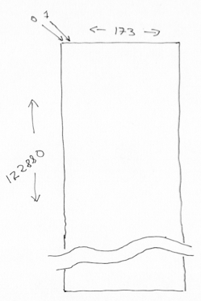

---
jupyter:
  jupytext:
    notebook_metadata_filter: all,-language_info
    split_at_heading: true
    text_representation:
      extension: .Rmd
      format_name: rmarkdown
      format_version: '1.2'
      jupytext_version: 1.13.7
  kernelspec:
    display_name: Python 3
    language: python
    name: python3
---

# Reshaping, 4D to 2D

See also: [Reshaping 4D images to 2D arrays](voxels_by_time.Rmd).

```{python}
import numpy as np
```

## Revision on 3D

We often find ourselves doing complicated reshape operations when we are
dealing with images.   For example, we may find ourselves reshaping the first
few dimensions, but leaving the last intact.

Let's start with a [familiar 3D array](reshape_and_3d.Rmd):

```{python}
arr_3d = np.reshape(np.arange(24), (2, 3, 4))
arr_3d
```

As ever, Numpy shows us the array by *row*, where each row is a 3 by 4 slab of
columns by plane.  Here is a picture of the same array represented as planes
of 2D row by column arrays:



Notice that Numpy has filled in the 3D array in the order *last* axis to *first* axis, therefore:

* plane, then
* column, then
* row.

Now imagine that we want to reshape only the first two dimensions, leaving the
last the same. This will take us from an array of shape (2, 3, 4), to an array
of shape (6, 4). The procedure is the same for all reshapes in NumPy. NumPy
makes an output array shape (6, 4), then takes each element over the last
dimension in the input, and fills the last dimension of the output, moves one
across on the second dimension of the input, then fills a line in the first
dimension of the output, and so on.

```{python}
arr_2d = np.reshape(arr_3d, (6, 4))
arr_2d
```

Notice how Numpy has filled out the two-dimensional array - by *getting* the data in the order *last* axis to *first* axis, so:

* plane, then
* column, then
* row

It therefore *gets* the original `np.arange(24)` array, and then *sets* the
data into the new array in the order last axis to first, therefore:

* column, then
* row.

See also: [Reshaping and three-dimensional arrays](reshape_and_3d.Rmd).

## To 4D

This kind of operation is commonly used on image data arrays.  Here we have
a 4D array from an fMRI run (`ds114_sub009_t2r1.nii`):

```{python}
# Fetch the data file to this computer.
import nipraxis
bold_fname = nipraxis.fetch_file('ds114_sub009_t2r1.nii')
# Show the filename
bold_fname
```

```{python}
import nibabel as nib
img = nib.load(bold_fname)
data = img.get_fdata()
data.shape
```

We can think of the 4D array as a sequence of 3D volumes:

```{python}
vol_shape = data.shape[:-1]
vol_shape
```

To get the number of voxels in the volume, we can use the `np.prod`
function on the shape. `np.prod` is like `np.sum`, but instead of adding
the elements, it multiplies them:

```{python}
n_voxels = np.prod(vol_shape)
n_voxels
```

Then we can reshape the array to 2D, with voxels on the first axis, and time
(volume) on the second.

```{python}
voxel_by_time = np.reshape(data, (n_voxels, data.shape[-1]))
voxel_by_time.shape
```



This is a useful operation when we want to apply some processing on all
voxels, without regard to their relative spatial position.
